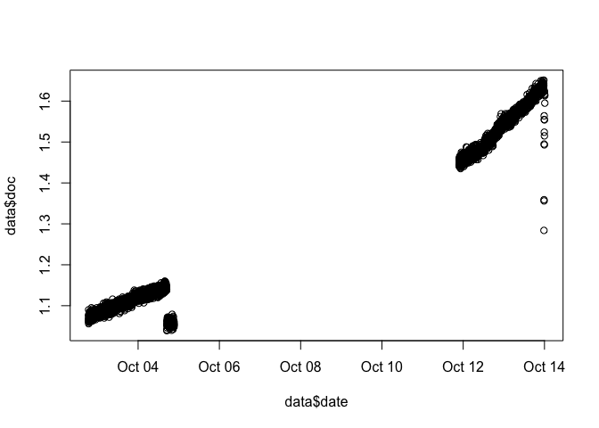

<!-- README.md is generated from README.Rmd. Please edit that file -->

# scan.tools

<!-- badges: start -->
<!-- badges: end -->

The goal of scan.tools is to improves workflow with using [S::Can
spectro::lyser UV
V2](https://www.s-can.at/products/spectrometer-probes)’s default analyte
output data format

## Installation

You can install the released version of scan.tools from
[Github.com/BrianY-Wang](https://github.com/BrianY-Wang/scan.Tools)
with:

``` r
# install.packages("devtools")
devtools::install_github("BrianY-Wang/scan.Tools")
```

## Example

This is a basic example which shows you how to use the package:

``` r
library(scan.tools)
data <- import("https://raw.githubusercontent.com/BrianY-Wang/foo/main/Raw_data/09210160.par", "8-digit-SerialNumber")

plot(data$date,data$doc)
```



### Repository Contents

-   B1 folder containing source script (.Rmd), readme and knitted files
-   Raw\_data folder containing unprocessed data output by the
    spectrolyzers
-   “.gitignore”“,”.DS\_Store"" and “.Rproj files”" are github and
    Rproject related files

## Author

\[@BrianWang\](<wybobrian@gmail.com>)

[Author Bio](https://ires.ubc.ca/person/brian-wang/)

[STAT545 Website](https://stat545.stat.ubc.ca/)

## Version History

-   [x] Release 2: Assignment B2 - Making an R Package
    -   Meeting the deliverable specified in [Assignment
        B2](https://stat545.stat.ubc.ca/assignments/assignment-b2/)
    -   Rendering documentations for all functions in the package with
        examples
    -   inclyde high level documentations (README, Descriptions)
-   [x] Release 1: Assignment B1 - Making a functions
    -   Meeting the deliverable specified in [Assignment
        B1](https://stat545.stat.ubc.ca/assignments/assignment-b1/)
    -   Made a function with examples
    -   Tested function output and input

## Acknowledgments

Thank you to STAT545 TAs and instructor Vincenzo for their patience and
feedback on this project. They have created a well supported environment
for learning and provided a mentored opportunity to explore my own
dataset.
